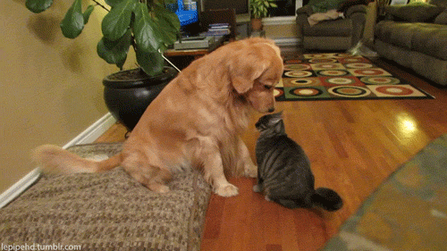

# In Class Workshop: 🐱 Cats and Dogs! 🐶

### Here are the things we'll need to make:
- A homepage
- A cats page 🐱
    - A "single cat" page
- A dogs page 🐶
    - A "single dog" page
- A navigation with links to the homepage, the cats page, and the dog page

### Some things to think about:
- What components are you going to need?
- What routes are you going to need? What params?
